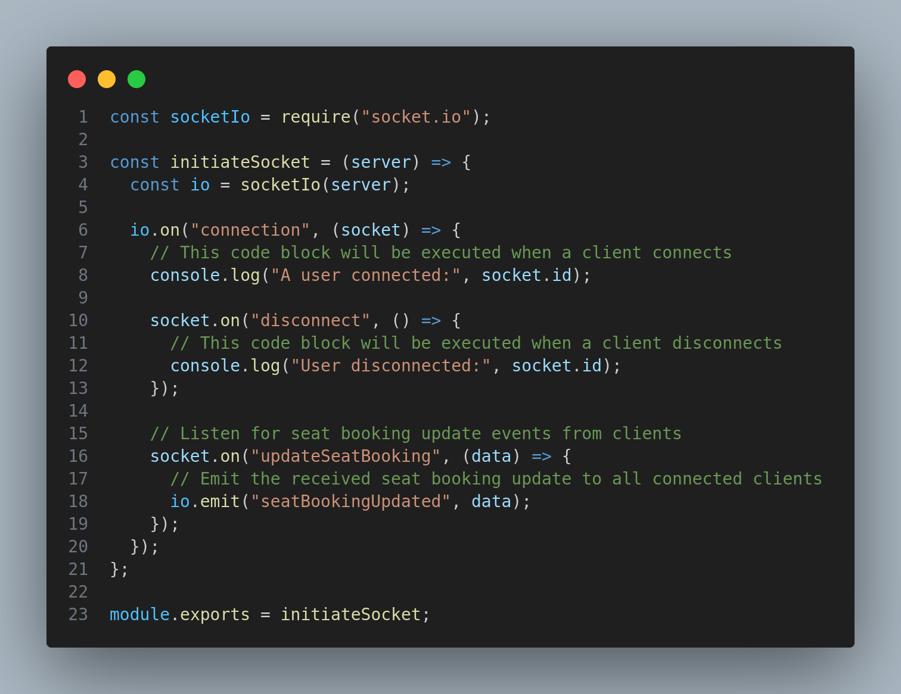

# Exo (Backend)

Welcome to the backend codebase of the Exo app. The backend has been built as an ExpressJS app powered by MongoDB, Cloudinary and more.

<b>IMPORTANT: This project is still under construction.</b>

## Technologies

The backend of the Exo app has been built using:

1. <b><a href="https://nodejs.org/en">Node.js</a></b> - an open-source cross-platform JavaScript runtime environment used to build applications running on servers. Node.js allows for asynchronous, event-driven and highly scalable applications, as in the case of Exo.
2. <b><a href="https://expressjs.com/">Express</a></b> - an open-source web framework for building RESTful APIs with Node.js. Express helps drastically reduce the development time associated with building on Node.js, along with a plethora of other benefits.
3. <b><a href="https://www.mongodb.com/">MongoDB</a></b> - a document-oriented NoSQL database management program for building scalable and flexible databases. MongoDB was selected for Exo due to its large ecosystem of supporting services, its ability to work with data in a model closely related to the JavaScript Object Notation (JSON) and its ability to outperform traditional relational databases in several occasions.
4. <b><a href="https://www.typescriptlang.org/">Cloudinary</a></b> - a SaaS solution for managing the media assets of an application in the cloud. Cloudinary offered us multiple services during the development of Exo, including upload, storage, transformation and more.

## Highlights

### Using `Socket.IO` to handle concurrent seat selection

The `Socket.IO` library was used to handle concurrent requests made by the client when two or more users are in the process of actively selecting seats, such that no two users will select the same seat, and thereby face a terrible user experience of having to reselect seats.

In theory, `Socket.IO` allowed use to display other users selecting seats in real-time to a user who is currently on the "Select Seats" page.

